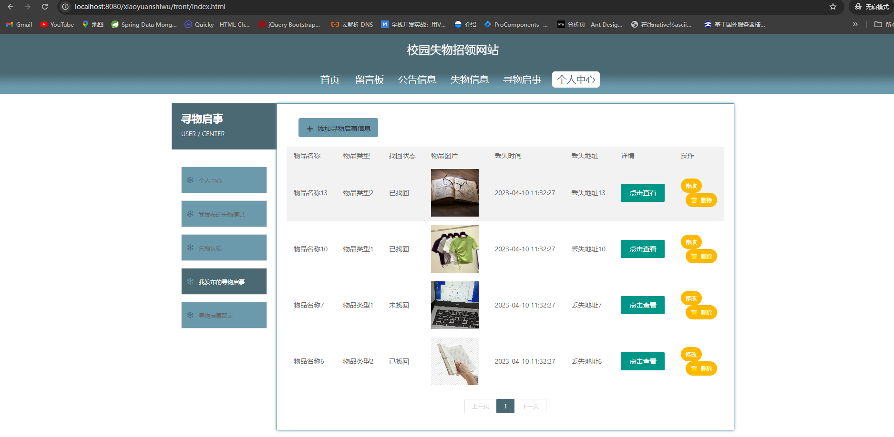
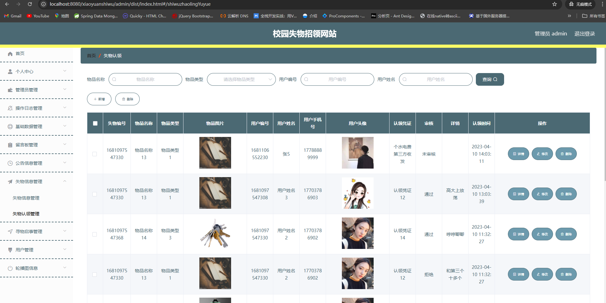

# 一、系统说明

基于springboot+vue+elementui开发的校园失物招领网站,系统功能齐全, 代码简洁易懂，适合小白学编程。

# 二、系统架构

######      前端：vue| elementui

######      后端：springboot | mybatis 

######      环境：jdk1.8+ | mysql8.0+ | maven

# 三、代码及数据库

# 四、相关功能介绍

#### 1).客户端

###### 1.登录

###### 2.注册

###### 3.首页

###### 4.留言板

###### 5.公告信息

###### 6.失物信息

###### 7.失物详情->失物招领

###### 8.寻物启事

###### 9.个人中心

###### 10.个人中心->我发布的失物信息

包含:添加失物信息、修改、删除功能

###### 11.个人中心->失物认领

包含:审核功能

###### 12.个人中心->我发布的寻物启事

###### 13.个人中心->寻物启事留言

#### 2).管理端

###### 1.登录

###### 2.个人中心->修改密码

###### 3.管理员管理

包含:删除、修改、新增、详情功能

###### 4.操作日志

包含:详情、修改、删除、新增功能

###### 5.基础数据管理

包含:公告类型管理、物品类型管理

###### 6.留言板管理

包含:修改、删除、详情、新增功能

###### 7.公告信息管理

包含:修改、删除、详情、新增功能

###### 8.失物信息管理

包含:新增、修改、详情、删除、认领分布报表

###### 9.失物信息管理->失物认领管理

包含:新增、修改、详情、删除功能

###### 10.寻物启事管理

包含:新增、修改、详情、删除、寻物启事分布功能

###### 11.寻物启事管理->寻物启事留言

包含:修改、详情、删除功能

###### 12.用户管理

包含:详情、新增、删除、修改、启用/禁用、重置密码功能

###### 13.轮播图管理

包含:新增、修改、删除、详情功能

######
